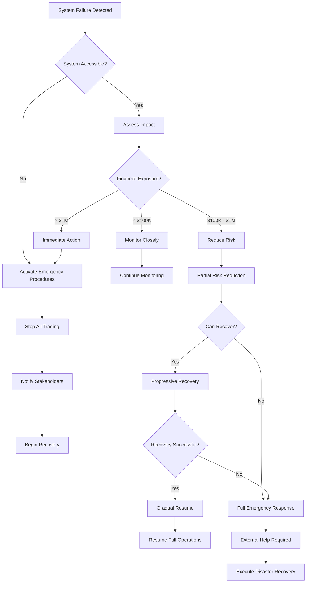
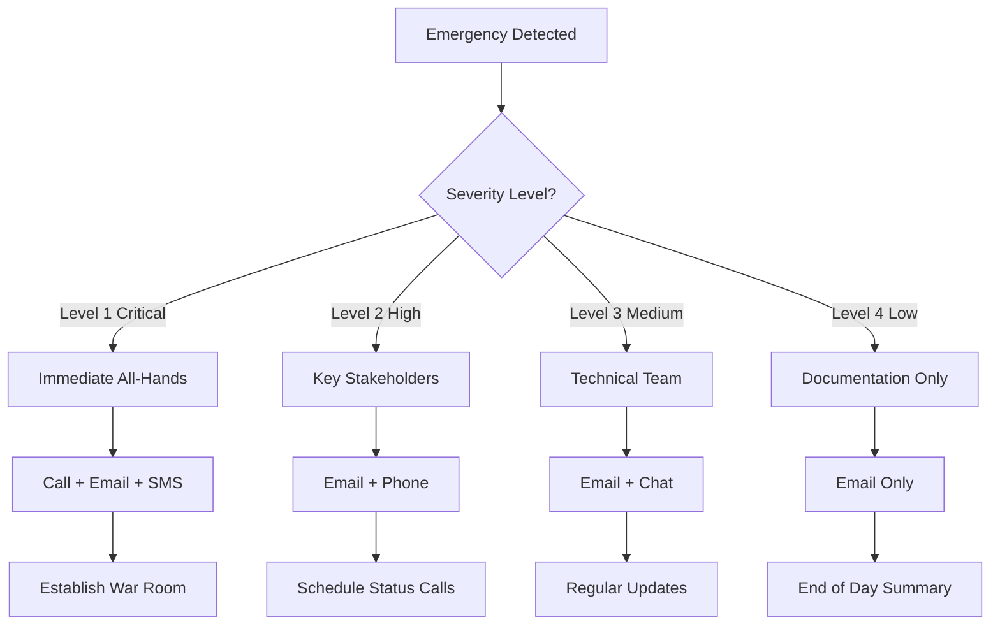

# Emergency Procedures

## Table of Contents
- [Emergency Overview](#emergency-overview)
- [Crisis Classification](#crisis-classification)
- [System Failure Response](#system-failure-response)
- [Trading System Failures](#trading-system-failures)
- [Security Incident Response](#security-incident-response)
- [Broker Connection Failures](#broker-connection-failures)
- [Database Emergency Procedures](#database-emergency-procedures)
- [Network and Connectivity Issues](#network-and-connectivity-issues)
- [Data Loss and Recovery](#data-loss-and-recovery)
- [Compliance and Regulatory Emergencies](#compliance-and-regulatory-emergencies)
- [Communication Procedures](#communication-procedures)
- [Recovery and Restoration](#recovery-and-restoration)
- [Post-Incident Procedures](#post-incident-procedures)
- [Emergency Contact Information](#emergency-contact-information)
- [Decision Trees and Flowcharts](#decision-trees-and-flowcharts)

## Emergency Overview

The Day Trading Orchestrator operates in a high-stakes environment where system failures can result in significant financial losses, regulatory violations, and reputational damage. This comprehensive emergency procedures guide provides detailed protocols for responding to various crisis scenarios to minimize impact and ensure rapid recovery.

### Emergency Response Objectives
1. **Protect Client Assets**: Safeguard trading positions and account balances
2. **Minimize Financial Loss**: Prevent or limit trading losses during outages
3. **Ensure Compliance**: Maintain regulatory compliance during incidents
4. **Restore Operations**: Restore full functionality as quickly as possible
5. **Document and Learn**: Capture lessons learned for continuous improvement

### Emergency Response Team
- **Incident Commander**: Overall emergency response coordination
- **Technical Lead**: System restoration and technical investigation
- **Risk Officer**: Risk assessment and exposure monitoring
- **Compliance Officer**: Regulatory compliance and reporting
- **Communications Lead**: Internal and external communications
- **Trading Operations**: Position management and broker coordination

### Emergency Severity Levels
- **Level 1 - Critical**: Complete system outage, data loss, or security breach
- **Level 2 - High**: Partial system failure, degraded performance, or minor security issues
- **Level 3 - Medium**: Non-critical component failures with workarounds available
- **Level 4 - Low**: Minor issues with minimal business impact

## Crisis Classification

### Critical Scenarios (Level 1)
**System-Wide Failure**:
- Complete system outage
- Database corruption or loss
- Security breach with data exposure
- Regulatory compliance violation
- Broker account compromise
- Data center failure

**Criteria for Level 1**:
- More than 50% of trading functionality affected
- Financial exposure exceeds $1M
- Regulatory reporting deadlines at risk
- Client data compromised
- Market integrity at risk

### High Priority Scenarios (Level 2)
**Partial System Failure**:
- Individual broker connection failure
- Database performance degradation
- Partial API outage
- Authentication system failure
- Network connectivity issues

**Criteria for Level 2**:
- 20-50% of trading functionality affected
- Financial exposure between $100K-$1M
- Workarounds available but not ideal
- No client data at risk

### Medium Priority Scenarios (Level 3)
**Component Failures**:
- Non-critical service failure
- Plugin or extension issues
- Monitoring system failure
- Backup system activation needed

**Criteria for Level 3**:
- Less than 20% of trading functionality affected
- Financial exposure under $100K
- Workarounds easily implemented
- No regulatory impact

## System Failure Response

### Complete System Outage Response
**Immediate Actions (0-5 minutes)**:
```bash
#!/bin/bash
# emergency_system_check.sh

echo "=== EMERGENCY SYSTEM CHECK ==="
echo "Timestamp: $(date)"
echo "Incident ID: $(uuidgen)"

# Check system status
check_system_status() {
    echo "Checking system components..."
    
    # Check if services are running
    if ! systemctl is-active --quiet trading-orchestrator; then
        echo "CRITICAL: Trading Orchestrator service is DOWN"
        return 1
    fi
    
    # Check database connectivity
    if ! pg_isready -h localhost -p 5432; then
        echo "CRITICAL: Database is UNREACHABLE"
        return 1
    fi
    
    # Check disk space
    disk_usage=$(df / | awk 'NR==2 {print $5}' | sed 's/%//')
    if [ $disk_usage -gt 90 ]; then
        echo "WARNING: Disk space is at ${disk_usage}%"
    fi
    
    # Check memory usage
    memory_usage=$(free | awk 'NR==2{printf "%.0f", $3*100/$2}')
    if [ $memory_usage -gt 90 ]; then
        echo "WARNING: Memory usage is at ${memory_usage}%"
    fi
    
    # Check network connectivity
    if ! ping -c 1 8.8.8.8 > /dev/null 2>&1; then
        echo "CRITICAL: No network connectivity"
        return 1
    fi
    
    echo "System status check completed"
    return 0
}

# Run system checks
check_system_status

# Emergency notification
send_emergency_notification() {
    local severity="$1"
    local message="$2"
    
    # Send to emergency channels
    echo "$(date): EMERGENCY - $severity - $message" | tee -a /var/log/emergency.log
    
    # Email notification
    mail -s "TRADING SYSTEM EMERGENCY - $severity" emergency@company.com << EOF
System Emergency Detected

Severity: $severity
Time: $(date)
Message: $message

Immediate response required.
EOF
    
    # Slack/Teams notification
    curl -X POST -H 'Content-type: application/json' \
        --data "{\"text\":\"🚨 TRADING SYSTEM EMERGENCY - $severity: $message\"}" \
        $WEBHOOK_URL
}

# Execute checks and notify
if ! check_system_status; then
    send_emergency_notification "CRITICAL" "System health check failed - immediate intervention required"
fi
```

**Level 1 Emergency Response Procedure**:
```python
#!/usr/bin/env python3
# emergency_response.py

import asyncio
import time
import json
import logging
from datetime import datetime
from typing import Dict, List, Any

class EmergencyResponseManager:
    def __init__(self):
        self.incident_id = str(uuid.uuid4())
        self.start_time = datetime.now()
        self.response_actions = []
        self.stakeholders = []
        
    async def initiate_emergency_response(self, severity: str, description: str):
        """Initiate Level 1 emergency response"""
        print(f"🚨 EMERGENCY RESPONSE INITIATED")
        print(f"Incident ID: {self.incident_id}")
        print(f"Severity: {severity}")
        print(f"Description: {description}")
        print(f"Start Time: {self.start_time}")
        
        # Immediate actions
        await self.execute_immediate_actions(severity)
        
        # Notify stakeholders
        await self.notify_stakeholders(severity, description)
        
        # Begin recovery procedures
        await self.begin_recovery_procedures()
    
    async def execute_immediate_actions(self, severity: str):
        """Execute immediate response actions"""
        if severity == "CRITICAL":
            await self.emergency_stop_trading()
            await self.freeze_accounts()
            await self.backup_critical_data()
            await self.activate_disaster_recovery()
    
    async def emergency_stop_trading(self):
        """Emergency stop all trading activities"""
        print("🛑 EXECUTING EMERGENCY TRADING STOP")
        
        try:
            # Cancel all pending orders
            await self.cancel_all_pending_orders()
            
            # Close risk positions
            await self.close_risk_positions()
            
            # Disable automated strategies
            await self.disable_automated_strategies()
            
            # Set maintenance mode
            await self.set_maintenance_mode(True)
            
            self.response_actions.append({
                'action': 'emergency_trading_stop',
                'timestamp': datetime.now(),
                'status': 'completed'
            })
            
        except Exception as e:
            print(f"⚠️ Emergency trading stop failed: {e}")
            await self.escalate_to_manual_intervention()
    
    async def cancel_all_pending_orders(self):
        """Cancel all pending orders across all brokers"""
        broker_connections = await self.get_active_broker_connections()
        
        tasks = []
        for broker_name, connection in broker_connections.items():
            task = self.cancel_broker_orders(broker_name, connection)
            tasks.append(task)
        
        results = await asyncio.gather(*tasks, return_exceptions=True)
        
        for i, result in enumerate(results):
            if isinstance(result, Exception):
                print(f"⚠️ Failed to cancel orders for broker {list(broker_connections.keys())[i]}: {result}")
    
    async def close_risk_positions(self):
        """Close high-risk positions immediately"""
        high_risk_positions = await self.identify_high_risk_positions()
        
        close_tasks = []
        for position in high_risk_positions:
            task = self.close_position(position)
            close_tasks.append(task)
        
        await asyncio.gather(*close_tasks)
    
    async def freeze_accounts(self):
        """Freeze all trading accounts"""
        print("🔒 FREEZING ALL ACCOUNTS")
        
        # Set account status to frozen
        await self.set_account_status('frozen', 'Emergency freeze')
        
        # Prevent new order submissions
        await self.disable_order_submission()
        
        self.response_actions.append({
            'action': 'account_freeze',
            'timestamp': datetime.now(),
            'status': 'completed'
        })
    
    async def backup_critical_data(self):
        """Create emergency backup of critical data"""
        print("💾 CREATING EMERGENCY BACKUP")
        
        backup_tasks = [
            self.backup_database(),
            self.backup_configuration(),
            self.backup_trading_data(),
            self.backup_logs()
        ]
        
        await asyncio.gather(*backup_tasks)
        
        self.response_actions.append({
            'action': 'emergency_backup',
            'timestamp': datetime.now(),
            'status': 'completed'
        })
    
    async def activate_disaster_recovery(self):
        """Activate disaster recovery procedures"""
        print("🔄 ACTIVATING DISASTER RECOVERY")
        
        # Check DR site availability
        dr_site_status = await self.check_dr_site_status()
        
        if dr_site_status['available']:
            print("✅ DR site is available - initiating failover")
            await self.initiate_failover_to_dr()
        else:
            print("❌ DR site unavailable - continuing with local recovery")
            await self.initiate_local_recovery()
    
    async def notify_stakeholders(self, severity: str, description: str):
        """Notify all stakeholders of emergency"""
        notification_tasks = [
            self.notify_management(severity, description),
            self.notify_technical_team(severity, description),
            self.notify_risk_team(severity, description),
            self.notify_compliance(severity, description),
            self.notify_clients(severity, description)
        ]
        
        await asyncio.gather(*notification_tasks)
    
    async def notify_management(self, severity: str, description: str):
        """Notify senior management"""
        message = f"""
CRITICAL SYSTEM EMERGENCY

Incident ID: {self.incident_id}
Severity: {severity}
Time: {datetime.now()}
Description: {description}

Immediate action required.
Trading operations have been halted.
Emergency response procedures activated.

Situation is being actively managed.
        """
        
        await self.send_notification('management', message, priority='high')
    
    async def begin_recovery_procedures(self):
        """Begin systematic recovery procedures"""
        print("🔧 BEGINNING RECOVERY PROCEDURES")
        
        recovery_phases = [
            self.diagnose_root_cause(),
            self.stabilize_system(),
            self.restore_services(),
            self.validate_functionality(),
            self.resume_operations()
        ]
        
        for phase in recovery_phases:
            try:
                await phase
            except Exception as e:
                print(f"⚠️ Recovery phase failed: {e}")
                await self.escalate_recovery_efforts()

# Usage
async def handle_critical_emergency():
    emergency_manager = EmergencyResponseManager()
    
    await emergency_manager.initiate_emergency_response(
        severity="CRITICAL",
        description="Complete system outage - all trading operations halted"
    )
```

### Service Recovery Procedures
**Progressive Recovery Strategy**:
```python
async def progressive_service_recovery():
    """Progressive recovery of services"""
    
    # Phase 1: Critical services
    await recover_database_service()
    await recover_authentication_service()
    await recover_risk_management_service()
    
    # Phase 2: Trading services
    await recover_order_management_service()
    await recover_position_management_service()
    await recover_strategy_engine()
    
    # Phase 3: Supporting services
    await recover_monitoring_service()
    await recover_reporting_service()
    await recover_backup_service()
    
    # Phase 4: Full system validation
    await run_comprehensive_tests()
    await validate_all_broker_connections()
    await verify_data_integrity()
    await confirm_compliance_status()

async def recover_database_service():
    """Database recovery procedures"""
    print("🔄 Recovering database service...")
    
    # Check database status
    db_status = await check_database_status()
    
    if not db_status['accessible']:
        print("Database is inaccessible - attempting recovery")
        await restore_database_from_backup()
        await verify_database_integrity()
    
    # Restart database if needed
    await restart_database_service()
    
    # Verify database functionality
    await verify_database_functionality()

async def recover_authentication_service():
    """Authentication service recovery"""
    print("🔐 Recovering authentication service...")
    
    # Restart authentication service
    await restart_auth_service()
    
    # Verify JWT tokens are still valid
    await validate_authentication_tokens()
    
    # Test login functionality
    await test_login_functionality()

async def recover_risk_management_service():
    """Risk management service recovery"""
    print("⚠️ Recovering risk management service...")
    
    # Reload risk parameters
    await reload_risk_parameters()
    
    # Verify risk calculations
    await verify_risk_calculations()
    
    # Test risk limit enforcement
    await test_risk_limits()
```

## Trading System Failures

### Order Management System Failure
**Emergency Order Handling**:
```python
class OrderManagementEmergencyHandler:
    def __init__(self):
        self.emergency_mode = False
        self.manual_queue = []
        self.failed_orders = []
    
    async def handle_oms_failure(self):
        """Handle Order Management System failure"""
        print("🚨 ORDER MANAGEMENT SYSTEM FAILURE DETECTED")
        
        # Activate emergency mode
        self.emergency_mode = True
        
        # Switch to manual order processing
        await self.activate_manual_order_processing()
        
        # Notify all stakeholders
        await self.notify_oms_failure()
        
        # Begin OMS recovery
        await self.recover_oms_system()
    
    async def activate_manual_order_processing(self):
        """Switch to manual order processing"""
        print("📝 ACTIVATING MANUAL ORDER PROCESSING")
        
        # Redirect all order requests to manual queue
        await self.setup_manual_order_queue()
        
        # Set up broker direct access
        await self.establish_broker_direct_access()
        
        # Prepare manual order templates
        await self.prepare_manual_order_templates()
    
    async def process_emergency_orders(self, orders: List[Dict]):
        """Process emergency orders manually"""
        print(f"Processing {len(orders)} emergency orders manually")
        
        for order in orders:
            try:
                # Validate order manually
                validation_result = await self.manual_order_validation(order)
                
                if validation_result['valid']:
                    # Execute via broker direct access
                    execution_result = await self.execute_broker_direct_order(order)
                    
                    if execution_result['success']:
                        print(f"✅ Emergency order executed: {order['symbol']} {order['side']} {order['quantity']}")
                    else:
                        self.failed_orders.append({
                            'order': order,
                            'error': execution_result['error'],
                            'timestamp': datetime.now()
                        })
                else:
                    self.failed_orders.append({
                        'order': order,
                        'error': f"Manual validation failed: {validation_result['reason']}",
                        'timestamp': datetime.now()
                    })
                    
            except Exception as e:
                print(f"❌ Failed to process emergency order: {e}")
                self.failed_orders.append({
                    'order': order,
                    'error': str(e),
                    'timestamp': datetime.now()
                })
        
        # Generate emergency order report
        await self.generate_emergency_order_report()
    
    async def manual_order_validation(self, order: Dict) -> Dict:
        """Manual order validation during emergency"""
        validation_checks = [
            self.check_account_balance(order),
            self.check_position_limits(order),
            self.check_risk_parameters(order),
            self.check_market_hours(order),
            self.check_symbol_validity(order)
        ]
        
        results = await asyncio.gather(*validation_checks)
        
        for result in results:
            if not result['passed']:
                return {
                    'valid': False,
                    'reason': result['message']
                }
        
        return {'valid': True}
    
    async def execute_broker_direct_order(self, order: Dict) -> Dict:
        """Execute order directly via broker API"""
        broker_name = order.get('broker', 'alpaca')
        
        try:
            if broker_name == 'alpaca':
                result = await self.execute_alpaca_order_direct(order)
            elif broker_name == 'binance':
                result = await self.execute_binance_order_direct(order)
            elif broker_name == 'interactive_brokers':
                result = await self.execute_ib_order_direct(order)
            else:
                return {
                    'success': False,
                    'error': f'Broker {broker_name} not supported in emergency mode'
                }
            
            return result
            
        except Exception as e:
            return {
                'success': False,
                'error': f'Direct broker execution failed: {str(e)}'
            }

# Emergency order template
EMERGENCY_ORDER_TEMPLATE = {
    "symbol": "",
    "side": "",  # BUY or SELL
    "quantity": 0,
    "order_type": "MARKET",  # Always use MARKET in emergency
    "broker": "",
    "account_id": "",
    "reason": "Emergency execution",
    "authorized_by": "",
    "timestamp": ""
}
```

### Strategy Engine Failure
**Emergency Strategy Management**:
```python
class StrategyEngineEmergencyHandler:
    def __init__(self):
        self.active_strategies = []
        self.failed_strategies = []
        self.manual_strategy_controls = {}
    
    async def handle_strategy_engine_failure(self):
        """Handle strategy engine failure"""
        print("🧠 STRATEGY ENGINE FAILURE DETECTED")
        
        # Immediately stop all automated trading
        await self.stop_all_strategies()
        
        # Capture current strategy states
        await self.capture_strategy_states()
        
        # Switch to manual trading mode
        await self.activate_manual_trading_mode()
        
        # Begin strategy engine recovery
        await self.recover_strategy_engine()
    
    async def stop_all_strategies(self):
        """Immediately stop all active strategies"""
        print("⏹️ STOPPING ALL STRATEGIES")
        
        for strategy in self.active_strategies:
            try:
                await strategy.emergency_stop()
                print(f"✅ Stopped strategy: {strategy.id}")
            except Exception as e:
                print(f"⚠️ Failed to stop strategy {strategy.id}: {e}")
                self.failed_strategies.append({
                    'strategy_id': strategy.id,
                    'error': str(e),
                    'timestamp': datetime.now()
                })
        
        # Clear strategy cache
        await self.clear_strategy_cache()
        
        # Disable strategy scheduler
        await self.disable_strategy_scheduler()
    
    async def capture_strategy_states(self):
        """Capture current strategy states for recovery"""
        print("📸 CAPTURING STRATEGY STATES")
        
        strategy_states = []
        
        for strategy in self.active_strategies:
            state = {
                'strategy_id': strategy.id,
                'strategy_type': strategy.type,
                'current_positions': strategy.get_positions(),
                'open_orders': strategy.get_open_orders(),
                'parameters': strategy.get_parameters(),
                'performance_metrics': strategy.get_performance_metrics(),
                'last_update': datetime.now()
            }
            strategy_states.append(state)
        
        # Save states to emergency backup
        await self.backup_strategy_states(strategy_states)
        
        return strategy_states
    
    async def activate_manual_trading_mode(self):
        """Switch to manual trading operations"""
        print("👤 ACTIVATING MANUAL TRADING MODE")
        
        # Set up manual trading interface
        await self.setup_manual_trading_interface()
        
        # Provide manual trading guidelines
        await self.display_manual_trading_guidelines()
        
        # Enable manual position management
        await self.enable_manual_position_management()
    
    async def recover_strategy_engine(self):
        """Recover strategy engine functionality"""
        print("🔄 RECOVERING STRATEGY ENGINE")
        
        recovery_steps = [
            self.restart_strategy_engine(),
            self.reload_strategy_configurations(),
            self.validate_strategy_plugins(),
            self.restore_strategy_states(),
            self.test_strategy_functionality(),
            self.gradual_strategy_reactivation()
        ]
        
        for step in recovery_steps:
            try:
                await step
                print("✅ Strategy engine recovery step completed")
            except Exception as e:
                print(f"❌ Strategy engine recovery step failed: {e}")
                await self.escalate_recovery_efforts()

# Manual trading guidelines during strategy engine failure
MANUAL_TRADING_GUIDELINES = """
=== MANUAL TRADING GUIDELINES DURING STRATEGY ENGINE FAILURE ===

IMMEDIATE ACTIONS:
1. Review all open positions for risk exposure
2. Cancel all pending strategy-generated orders
3. Monitor market movements closely
4. Set up price alerts for critical levels

POSITION MANAGEMENT:
- Only close positions if risk parameters are exceeded
- Avoid opening new positions without proper risk assessment
- Monitor position sizes and exposure limits
- Consider hedge positions if needed

RISK MONITORING:
- Check VaR calculations manually
- Monitor correlation exposure
- Verify margin requirements
- Review concentration limits

COMMUNICATION:
- Report all manual actions to risk team
- Document all trading decisions
- Maintain communication with management
- Prepare summary report of actions taken

RECOVERY:
- Wait for strategy engine restoration
- Validate all strategy states before reactivation
- Gradually restart strategies with reduced position sizes
- Monitor performance closely after recovery
"""
```

## Security Incident Response

### Security Breach Response
**Immediate Security Actions**:
```python
class SecurityIncidentResponse:
    def __init__(self):
        self.incident_id = str(uuid.uuid4())
        self.security_level = "HIGH"
        self.actions_taken = []
        
    async def handle_security_incident(self, incident_type: str, severity: str):
        """Handle security incident response"""
        print(f"🚨 SECURITY INCIDENT: {incident_type}")
        print(f"Incident ID: {self.incident_id}")
        print(f"Severity: {severity}")
        
        # Immediate containment
        await self.contain_security_threat(incident_type)
        
        # Notify security team
        await self.notify_security_team(incident_type, severity)
        
        # Begin forensic investigation
        await self.begin_forensic_investigation()
        
        # Document incident
        await self.document_security_incident(incident_type)
    
    async def contain_security_threat(self, incident_type: str):
        """Immediate containment of security threat"""
        containment_actions = []
        
        if incident_type == "unauthorized_access":
            # Block all suspicious accounts
            await self.block_suspicious_accounts()
            containment_actions.append("blocked_suspicious_accounts")
            
            # Force password resets
            await self.force_password_resets()
            containment_actions.append("forced_password_resets")
            
            # Enable additional authentication
            await self.enable_mfa_enforcement()
            containment_actions.append("enabled_mfa")
        
        elif incident_type == "data_breach":
            # Isolate affected systems
            await self.isolate_affected_systems()
            containment_actions.append("isolated_affected_systems")
            
            # Preserve evidence
            await self.preserve_forensic_evidence()
            containment_actions.append("preserved_evidence")
            
            # Notify relevant parties
            await self.notify_data_breach_stakeholders()
            containment_actions.append("notified_stakeholders")
        
        elif incident_type == "malware_infection":
            # Quarantine infected systems
            await self.quarantine_infected_systems()
            containment_actions.append("quarantined_systems")
            
            # Scan for malware
            await self.comprehensive_malware_scan()
            containment_actions.append("completed_malware_scan")
            
            # Update security signatures
            await self.update_security_signatures()
            containment_actions.append("updated_security_signatures")
        
        self.actions_taken.extend(containment_actions)
        print(f"✅ Containment actions completed: {containment_actions}")
    
    async def isolate_affected_systems(self):
        """Isolate systems affected by security incident"""
        print("🔒 ISOLATING AFFECTED SYSTEMS")
        
        # Disable network access for affected systems
        await self.disable_network_access()
        
        # Disable user accounts
        await self.disable_user_accounts()
        
        # Revoke API keys
        await self.revoke_api_keys()
        
        # Enable audit logging
        await self.enable_detailed_audit_logging()
    
    async def preserve_forensic_evidence(self):
        """Preserve forensic evidence"""
        print("🔍 PRESERVING FORENSIC EVIDENCE")
        
        # Create forensic images
        await self.create_forensic_images()
        
        # Collect log files
        await self.collect_log_files()
        
        # Document system states
        await self.document_system_states()
        
        # Secure evidence storage
        await self.secure_evidence_storage()

# Security incident checklist
SECURITY_INCIDENT_CHECKLIST = """
=== SECURITY INCIDENT RESPONSE CHECKLIST ===

IMMEDIATE ACTIONS (0-15 minutes):
□ Identify incident type and scope
□ Contain the threat
□ Preserve evidence
□ Notify security team
□ Activate incident response team
□ Begin initial assessment

CONTAINMENT (15-60 minutes):
□ Isolate affected systems
□ Disable compromised accounts
□ Revoke access tokens
□ Block malicious traffic
□ Update security controls
□ Document all actions

INVESTIGATION (1-4 hours):
□ Collect forensic evidence
□ Analyze attack vectors
□ Identify compromised data
□ Assess impact
□ Determine root cause
□ Prepare forensic report

RECOVERY (4-24 hours):
□ Remove threat
□ Patch vulnerabilities
□ Restore from clean backups
□ Validate system integrity
□ Monitor for persistence
□ Gradual system restoration

COMMUNICATION:
□ Internal stakeholders
□ External partners
□ Regulatory bodies
□ Law enforcement (if required)
□ Clients (if affected)
□ Public disclosure (if required)

LESSONS LEARNED:
□ Incident analysis
□ Response evaluation
□ Process improvements
□ Training updates
□ Documentation updates
□ Policy revisions
"""
```

### Data Breach Response
**Data Breach Handling Procedures**:
```python
class DataBreachResponse:
    def __init__(self):
        self.breach_discovered = datetime.now()
        self.affected_data = {}
        self.breach_scope = {}
        
    async def handle_data_breach(self, breach_details: Dict):
        """Comprehensive data breach response"""
        print("🚨 DATA BREACH DETECTED")
        
        # Immediate containment
        await self.contain_data_breach(breach_details)
        
        # Assess breach scope
        await self.assess_breach_scope(breach_details)
        
        # Begin regulatory notification process
        await self.begin_regulatory_notification()
        
        # Prepare breach notification
        await self.prepare_breach_notifications()
        
        # Implement additional security measures
        await self.implement_additional_security()
    
    async def assess_breach_scope(self, breach_details: Dict):
        """Assess the scope of data breach"""
        print("🔍 ASSESSING BREACH SCOPE")
        
        # Identify affected systems
        affected_systems = await self.identify_affected_systems(breach_details)
        
        # Determine data types compromised
        compromised_data_types = await self.identify_compromised_data(breach_details)
        
        # Estimate number of affected records
        affected_record_count = await self.estimate_affected_records(breach_details)
        
        # Assess regulatory implications
        regulatory_implications = await self.assess_regulatory_implications(
            affected_systems, compromised_data_types, affected_record_count
        )
        
        self.breach_scope = {
            'affected_systems': affected_systems,
            'compromised_data_types': compromised_data_types,
            'affected_record_count': affected_record_count,
            'regulatory_implications': regulatory_implications,
            'assessment_timestamp': datetime.now()
        }
        
        return self.breach_scope
    
    async def begin_regulatory_notification(self):
        """Begin regulatory notification process"""
        print("📢 BEGINNING REGULATORY NOTIFICATION")
        
        # GDPR notification (72 hours)
        if self.breach_scope.get('regulatory_implications', {}).get('gdpr_applicable'):
            await self.notify_gdpr_regulator()
        
        # SOX notification
        if self.breach_scope.get('regulatory_implications', {}).get('sox_applicable'):
            await self.notify_sox_regulator()
        
        # PCI DSS notification
        if self.breach_scope.get('regulatory_implications', {}).get('pci_applicable'):
            await self.notify_pci_regulator()
        
        # SEC notification
        if self.breach_scope.get('regulatory_implications', {}).get('sec_applicable'):
            await self.notify_sec_regulator()
    
    async def prepare_breach_notifications(self):
        """Prepare breach notifications for affected parties"""
        print("📝 PREPARING BREACH NOTIFICATIONS")
        
        # Prepare client notification
        await self.prepare_client_notification()
        
        # Prepare employee notification
        await self.prepare_employee_notification()
        
        # Prepare partner notification
        await self.prepare_partner_notification()
        
        # Prepare public disclosure
        await self.prepare_public_disclosure()
        
        # Set up notification channels
        await self.setup_notification_channels()
```

## Broker Connection Failures

### Multi-Broker Emergency Handling
**Broker Connection Recovery**:
```python
class BrokerConnectionEmergencyHandler:
    def __init__(self):
        self.broker_status = {}
        self.failed_connections = []
        self.recovery_attempts = {}
        
    async def handle_broker_connection_failure(self, broker_name: str, failure_details: Dict):
        """Handle broker connection failure"""
        print(f"🔌 BROKER CONNECTION FAILURE: {broker_name}")
        
        # Mark broker as failed
        await self.mark_broker_failed(broker_name)
        
        # Redirect trading to alternative brokers
        await self.redistribute_trading_load(broker_name)
        
        # Attempt connection recovery
        await self.attempt_broker_recovery(broker_name)
        
        # Monitor alternative broker performance
        await self.monitor_alternative_brokers()
        
        # Update trading algorithms
        await self.update_trading_algorithms(broker_name)
    
    async def redistribute_trading_load(self, failed_broker: str):
        """Redistribute trading load to alternative brokers"""
        print(f"⚖️ REDISTRIBUTING TRADING LOAD FROM {failed_broker}")
        
        # Get available brokers
        available_brokers = await self.get_available_brokers()
        
        # Get current trading positions for failed broker
        failed_positions = await self.get_broker_positions(failed_broker)
        
        # Calculate redistribution weights
        redistribution_weights = await self.calculate_redistribution_weights(available_brokers)
        
        # Redistribute positions
        for position in failed_positions:
            target_broker = self.select_best_alternative_broker(redistribution_weights)
            await self.transfer_position(position, failed_broker, target_broker)
        
        # Update order routing
        await self.update_order_routing(failed_broker, available_brokers)
    
    async def transfer_position(self, position: Dict, from_broker: str, to_broker: str):
        """Transfer position between brokers"""
        print(f"📦 TRANSFERRING POSITION: {position['symbol']} FROM {from_broker} TO {to_broker}")
        
        try:
            # Close position at source broker
            close_result = await self.close_position_at_broker(position, from_broker)
            
            if close_result['success']:
                # Open equivalent position at target broker
                open_result = await self.open_position_at_broker(
                    position, to_broker
                )
                
                if open_result['success']:
                    print(f"✅ Position transferred successfully")
                    return {'success': True, 'details': 'position_transferred'}
                else:
                    return {'success': False, 'error': 'failed_to_open_at_target'}
            else:
                return {'success': False, 'error': 'failed_to_close_at_source'}
                
        except Exception as e:
            print(f"❌ Position transfer failed: {e}")
            return {'success': False, 'error': str(e)}

# Emergency broker switch procedures
BROKER_SWITCH_PROCEDURES = """
=== EMERGENCY BROKER SWITCH PROCEDURES ===

LEVEL 1: SINGLE BROKER FAILURE
1. Identify failed broker
2. Assess impact on positions
3. Redistribute orders to available brokers
4. Monitor alternative broker capacity
5. Update risk parameters

LEVEL 2: MULTIPLE BROKER FAILURE
1. Activate backup broker connections
2. Reduce position sizes
3. Implement circuit breakers
4. Switch to manual trading mode
5. Notify all stakeholders

LEVEL 3: ALL BROKER FAILURE
1. Stop all automated trading
2. Close positions manually via broker platforms
3. Activate emergency trading procedures
4. Notify compliance and risk teams
5. Prepare for system shutdown if necessary

MANUAL TRADING PROCEDURES:
- Use broker web interfaces directly
- Execute market orders only
- Monitor positions continuously
- Document all actions
- Report to risk team immediately
"""
```

## Database Emergency Procedures

### Database Failure Response
**Emergency Database Recovery**:
```python
class DatabaseEmergencyHandler:
    def __init__(self):
        self.database_status = {}
        self.backup_locations = []
        self.recovery_procedures = {}
        
    async def handle_database_failure(self, failure_details: Dict):
        """Handle database system failure"""
        print("💾 DATABASE FAILURE DETECTED")
        
        # Assess failure severity
        failure_severity = await self.assess_database_failure(failure_details)
        
        # Implement immediate containment
        await self.contain_database_failure(failure_details)
        
        # Begin recovery procedures
        await self.begin_database_recovery(failure_severity)
        
        # Monitor recovery progress
        await self.monitor_database_recovery()
        
        # Validate data integrity
        await self.validate_database_integrity()
    
    async def assess_database_failure(self, failure_details: Dict) -> str:
        """Assess database failure severity"""
        failure_type = failure_details.get('type')
        
        if failure_type == 'complete_outage':
            return 'CRITICAL'
        elif failure_type == 'performance_degradation':
            return 'HIGH'
        elif failure_type == 'data_corruption':
            return 'CRITICAL'
        elif failure_type == 'connection_issues':
            return 'MEDIUM'
        
        return 'UNKNOWN'
    
    async def contain_database_failure(self, failure_details: Dict):
        """Contain database failure impact"""
        print("🔒 CONTAINING DATABASE FAILURE")
        
        # Switch to read replica if available
        if await self.has_read_replica():
            print("Switching to read replica...")
            await self.switch_to_read_replica()
        
        # Activate write cache
        await self.activate_write_cache()
        
        # Enable database failover
        await self.enable_database_failover()
        
        # Log failure details
        await self.log_database_failure(failure_details)
    
    async def begin_database_recovery(self, severity: str):
        """Begin database recovery procedures"""
        print(f"🔄 BEGINNING DATABASE RECOVERY - SEVERITY: {severity}")
        
        if severity == 'CRITICAL':
            await self.critical_database_recovery()
        elif severity == 'HIGH':
            await self.high_priority_database_recovery()
        elif severity == 'MEDIUM':
            await self.medium_priority_database_recovery()
    
    async def critical_database_recovery(self):
        """Critical database recovery procedures"""
        recovery_steps = [
            self.restart_database_service(),
            self.restore_from_latest_backup(),
            self.apply_transaction_log_recovery(),
            self.verify_data_integrity(),
            self.test_critical_operations(),
            self.restore_full_functionality()
        ]
        
        for step in recovery_steps:
            try:
                result = await step
                if not result['success']:
                    print(f"❌ Recovery step failed: {result['error']}")
                    await self.escalate_recovery_efforts()
                    break
                print(f"✅ Recovery step completed: {step.__name__}")
            except Exception as e:
                print(f"❌ Recovery step exception: {e}")
                await self.escalate_recovery_efforts()
                break
    
    async def restore_from_latest_backup(self) -> Dict:
        """Restore database from latest backup"""
        print("📦 RESTORING FROM LATEST BACKUP")
        
        # Get latest backup information
        backup_info = await self.get_latest_backup_info()
        
        # Download backup from secure location
        await self.download_backup(backup_info)
        
        # Restore database from backup
        restore_result = await self.execute_database_restore(backup_info)
        
        # Verify restore success
        if restore_result['success']:
            print("✅ Database restoration successful")
            return {'success': True, 'backup_info': backup_info}
        else:
            print("❌ Database restoration failed")
            return {'success': False, 'error': restore_result['error']}

# Database recovery procedures
DATABASE_RECOVERY_PROCEDURES = """
=== DATABASE EMERGENCY RECOVERY PROCEDURES ===

IMMEDIATE ACTIONS (0-5 minutes):
□ Assess failure type and severity
□ Notify database team and management
□ Switch to read replica if available
□ Activate write cache for critical operations
□ Begin logging all recovery actions

CONTAINMENT (5-15 minutes):
□ Isolate failed database instance
□ Preserve forensic evidence
□ Check for data corruption
□ Assess backup availability
□ Prepare recovery environment

RECOVERY (15-60 minutes):
□ Restore from latest consistent backup
□ Apply transaction log recovery
□ Verify data integrity
□ Test critical operations
□ Restore full read/write access

VALIDATION (60-120 minutes):
□ Run comprehensive data integrity checks
□ Test all application integrations
□ Verify performance metrics
□ Confirm backup systems
□ Document recovery process

POST-RECOVERY:
□ Monitor system performance
□ Review root cause
□ Update recovery procedures
□ Conduct lessons learned session
□ Update disaster recovery plan
"""
```

## Network and Connectivity Issues

### Network Failure Response
**Network Connectivity Emergency Procedures**:
```python
class NetworkEmergencyHandler:
    def __init__(self):
        self.network_status = {}
        self.backup_connections = []
        self.connectivity_tests = {}
        
    async def handle_network_failure(self, failure_scope: str, failure_details: Dict):
        """Handle network connectivity failure"""
        print(f"🌐 NETWORK FAILURE: {failure_scope}")
        
        # Assess network failure scope
        await self.assess_network_failure(failure_scope, failure_details)
        
        # Activate backup connections
        await self.activate_backup_connections(failure_scope)
        
        # Implement network redundancy
        await self.implement_network_redundancy(failure_scope)
        
        # Monitor connectivity status
        await self.monitor_connectivity_status()
        
        # Coordinate with network team
        await self.coordinate_with_network_team(failure_details)
    
    async def assess_network_failure(self, scope: str, details: Dict):
        """Assess network failure scope and impact"""
        print(f"🔍 ASSESSING NETWORK FAILURE: {scope}")
        
        if scope == 'internet_connectivity':
            await self.handle_internet_connectivity_failure()
        elif scope == 'broker_connections':
            await self.handle_broker_connectivity_failure()
        elif scope == 'database_connectivity':
            await self.handle_database_connectivity_failure()
        elif scope == 'internal_network':
            await self.handle_internal_network_failure()
        
        # Test connectivity to critical services
        await self.test_critical_connectivity()
    
    async def handle_internet_connectivity_failure(self):
        """Handle complete internet connectivity loss"""
        print("🌍 INTERNET CONNECTIVITY LOST")
        
        # Activate offline trading mode
        await self.activate_offline_trading_mode()
        
        # Use backup internet connection
        await self.activate_backup_internet_connection()
        
        # Switch to local data sources
        await self.switch_to_local_data_sources()
        
        # Notify stakeholders of connectivity issues
        await self.notify_connectivity_outage()
    
    async def activate_offline_trading_mode(self):
        """Activate offline trading operations"""
        print("📱 ACTIVATING OFFLINE TRADING MODE")
        
        # Switch to manual trading operations
        await self.enable_manual_trading()
        
        # Use cached market data
        await self.activate_cached_market_data()
        
        # Enable local order processing
        await self.enable_local_order_processing()
        
        # Set up manual position tracking
        await self.enable_manual_position_tracking()

# Network connectivity monitoring
class NetworkConnectivityMonitor:
    def __init__(self):
        self.monitoring_active = False
        self.connectivity_history = []
        
    async def continuous_connectivity_monitoring(self):
        """Continuous network connectivity monitoring"""
        self.monitoring_active = True
        
        while self.monitoring_active:
            await self.check_all_connectivity()
            await asyncio.sleep(30)  # Check every 30 seconds
    
    async def check_all_connectivity(self):
        """Check connectivity to all critical services"""
        connectivity_checks = [
            self.check_internet_connectivity(),
            self.check_broker_connectivity(),
            self.check_database_connectivity(),
            self.check_external_apis()
        ]
        
        results = await asyncio.gather(*connectivity_checks, return_exceptions=True)
        
        connectivity_status = {
            'internet': results[0] if not isinstance(results[0], Exception) else False,
            'brokers': results[1] if not isinstance(results[1], Exception) else False,
            'database': results[2] if not isinstance(results[2], Exception) else False,
            'external_apis': results[3] if not isinstance(results[3], Exception) else False
        }
        
        self.connectivity_history.append({
            'timestamp': datetime.now(),
            'status': connectivity_status
        })
        
        # Detect connectivity issues
        if not all(connectivity_status.values()):
            await self.handle_connectivity_issues(connectivity_status)
        
        return connectivity_status
    
    async def handle_connectivity_issues(self, status: Dict):
        """Handle connectivity issues"""
        failed_services = [service for service, available in status.items() if not available]
        
        if failed_services:
            print(f"⚠️ Connectivity issues detected: {failed_services}")
            await self.notify_connectivity_issues(failed_services)
```

## Data Loss and Recovery

### Data Recovery Procedures
**Emergency Data Recovery**:
```python
class DataRecoveryManager:
    def __init__(self):
        self.backup_strategies = {}
        self.recovery_procedures = {}
        self.data_integrity_checks = []
        
    async def handle_data_loss_incident(self, data_type: str, loss_details: Dict):
        """Handle data loss incident"""
        print(f"📉 DATA LOSS INCIDENT: {data_type}")
        
        # Assess data loss scope
        loss_scope = await self.assess_data_loss_scope(data_type, loss_details)
        
        # Implement immediate containment
        await self.contain_data_loss(data_type, loss_scope)
        
        # Begin recovery procedures
        await self.begin_data_recovery(data_type, loss_scope)
        
        # Validate recovered data
        await self.validate_recovered_data(data_type)
        
        # Restore full functionality
        await self.restore_data_functionality(data_type)
    
    async def assess_data_loss_scope(self, data_type: str, details: Dict) -> Dict:
        """Assess scope of data loss"""
        print(f"🔍 ASSESSING DATA LOSS SCOPE FOR {data_type}")
        
        scope_assessment = {
            'data_type': data_type,
            'loss_timeframe': details.get('timeframe'),
            'affected_records': details.get('affected_records', 0),
            'backup_availability': await self.check_backup_availability(data_type),
            'recovery_time_estimate': await self.estimate_recovery_time(data_type, details),
            'business_impact': await self.assess_business_impact(data_type, details)
        }
        
        return scope_assessment
    
    async def begin_data_recovery(self, data_type: str, scope: Dict):
        """Begin data recovery procedures"""
        print(f"🔄 BEGINNING DATA RECOVERY FOR {data_type}")
        
        recovery_strategies = [
            self.restore_from_backup(data_type, scope),
            self.reconstruct_from_logs(data_type, scope),
            self.rebuild_from_external_sources(data_type, scope),
            self.manual_data_reconstruction(data_type, scope)
        ]
        
        # Try recovery strategies in order of preference
        for strategy in recovery_strategies:
            try:
                recovery_result = await strategy
                if recovery_result['success']:
                    print(f"✅ Data recovery successful using {strategy.__name__}")
                    return recovery_result
                else:
                    print(f"❌ Recovery strategy {strategy.__name__} failed")
                    continue
            except Exception as e:
                print(f"❌ Recovery strategy {strategy.__name__} exception: {e}")
                continue
        
        print("❌ All recovery strategies failed")
        return {'success': False, 'error': 'all_strategies_failed'}
    
    async def restore_from_backup(self, data_type: str, scope: Dict) -> Dict:
        """Restore data from backup"""
        print(f"💾 RESTORING {data_type} FROM BACKUP")
        
        # Get appropriate backup
        backup_info = await self.select_backup_for_recovery(data_type, scope)
        
        if not backup_info['available']:
            return {'success': False, 'error': 'backup_not_available'}
        
        # Download backup if needed
        if backup_info['location'] != 'local':
            await self.download_backup(backup_info)
        
        # Restore data from backup
        restore_result = await self.execute_data_restore(data_type, backup_info)
        
        return restore_result
    
    async def reconstruct_from_logs(self, data_type: str, scope: Dict) -> Dict:
        """Reconstruct data from transaction logs"""
        print(f"📋 RECONSTRUCTING {data_type} FROM TRANSACTION LOGS")
        
        # Collect relevant transaction logs
        log_files = await self.collect_transaction_logs(data_type, scope)
        
        # Parse transaction logs
        transactions = await self.parse_transaction_logs(log_files)
        
        # Reconstruct data from transactions
        reconstructed_data = await self.reconstruct_data_from_transactions(transactions, data_type)
        
        # Validate reconstructed data
        validation_result = await self.validate_reconstructed_data(reconstructed_data, data_type)
        
        if validation_result['valid']:
            # Save reconstructed data
            await self.save_reconstructed_data(reconstructed_data, data_type)
            return {'success': True, 'method': 'log_reconstruction'}
        else:
            return {'success': False, 'error': 'reconstruction_validation_failed'}

# Data loss assessment template
DATA_LOSS_ASSESSMENT_TEMPLATE = """
=== DATA LOSS ASSESSMENT TEMPLATE ===

INCIDENT DETAILS:
- Data Type: _______________
- Loss Timeframe: _______________
- Discovery Time: _______________
- Affected Records: _______________

BACKUP ANALYSIS:
- Latest Backup Date: _______________
- Backup Location: _______________
- Backup Integrity: _______________
- Backup Size: _______________

RECOVERY ASSESSMENT:
- Recovery Time Estimate: _______________
- Recovery Method: _______________
- Data Loss Impact: _______________
- Business Risk Level: _______________

APPROVALS REQUIRED:
- Technical Lead: _______________
- Risk Officer: _______________
- Management: _______________
- Compliance: _______________
"""
```

## Compliance and Regulatory Emergencies

### Regulatory Violation Response
**Compliance Emergency Procedures**:
```python
class ComplianceEmergencyHandler:
    def __init__(self):
        self.violation_types = {}
        self.regulatory_contacts = {}
        self.compliance_actions = []
        
    async def handle_regulatory_violation(self, violation_type: str, violation_details: Dict):
        """Handle regulatory violation"""
        print(f"⚖️ REGULATORY VIOLATION: {violation_type}")
        
        # Immediate containment
        await self.contain_regulatory_violation(violation_type, violation_details)
        
        # Assess violation scope
        violation_scope = await self.assess_violation_scope(violation_type, violation_details)
        
        # Begin regulatory notification
        await self.begin_regulatory_notification(violation_type, violation_scope)
        
        # Implement corrective measures
        await self.implement_corrective_measures(violation_type, violation_scope)
        
        # Prepare compliance documentation
        await self.prepare_compliance_documentation(violation_type, violation_details)
    
    async def contain_regulatory_violation(self, violation_type: str, details: Dict):
        """Contain regulatory violation"""
        print(f"🔒 CONTAINING REGULATORY VIOLATION: {violation_type}")
        
        containment_actions = []
        
        if violation_type == 'trade_reporting_failure':
            # Immediately submit all pending reports
            await self.submit_pending_reports()
            containment_actions.append('submitted_pending_reports')
            
            # Implement trade reporting monitoring
            await self.enable_trade_reporting_monitoring()
            containment_actions.append('enabled_reporting_monitoring')
        
        elif violation_type == 'position_limit_exceeded':
            # Immediately reduce positions
            await self.reduce_positions_to_compliant_levels()
            containment_actions.append('reduced_positions')
            
            # Freeze trading in affected instruments
            await self.freeze_trading_instruments()
            containment_actions.append('frozen_trading')
        
        elif violation_type == 'market_manipulation_suspected':
            # Cease all trading activities
            await self.cease_all_trading_activities()
            containment_actions.append('ceased_trading')
            
            # Preserve all trading records
            await self.preserve_trading_records()
            containment_actions.append('preserved_records')
        
        self.compliance_actions.extend(containment_actions)
        return containment_actions
    
    async def assess_violation_scope(self, violation_type: str, details: Dict) -> Dict:
        """Assess scope of regulatory violation"""
        print(f"🔍 ASSESSING VIOLATION SCOPE: {violation_type}")
        
        scope_assessment = {
            'violation_type': violation_type,
            'affected_trades': details.get('affected_trades', []),
            'financial_impact': await self.calculate_financial_impact(violation_type, details),
            'regulatory_implications': await self.assess_regulatory_implications(violation_type),
            'client_impact': await self.assess_client_impact(violation_type, details),
            'market_impact': await self.assess_market_impact(violation_type, details),
            'reporting_requirements': await self.determine_reporting_requirements(violation_type)
        }
        
        return scope_assessment
    
    async def begin_regulatory_notification(self, violation_type: str, scope: Dict):
        """Begin regulatory notification process"""
        print(f"📢 BEGINNING REGULATORY NOTIFICATION: {violation_type}")
        
        notification_schedule = await self.create_notification_schedule(violation_type, scope)
        
        for notification in notification_schedule:
            await self.send_regulatory_notification(notification)
        
        # Prepare regulatory response team
        await self.prepare_regulatory_response_team(violation_type)
    
    async def implement_corrective_measures(self, violation_type: str, scope: Dict):
        """Implement corrective measures"""
        print(f"🔧 IMPLEMENTING CORRECTIVE MEASURES: {violation_type}")
        
        corrective_measures = await self.determine_corrective_measures(violation_type, scope)
        
        for measure in corrective_measures:
            await self.execute_corrective_measure(measure)
            await self.verify_corrective_measure(measure)
        
        # Update compliance procedures
        await self.update_compliance_procedures(violation_type, corrective_measures)

# Regulatory notification procedures
REGULATORY_NOTIFICATION_SCHEDULE = """
=== REGULATORY NOTIFICATION SCHEDULE ===

IMMEDIATE NOTIFICATIONS (0-4 hours):
- Internal senior management
- Compliance officer
- Risk management team
- Legal counsel

URGENT NOTIFICATIONS (4-24 hours):
- Primary regulator
- Secondary regulators (if applicable)
- Self-regulatory organization
- Clearing houses

STANDARD NOTIFICATIONS (24-72 hours):
- Affected clients
- Business partners
- Insurance providers
- Audit committee

DOCUMENTATION REQUIRED:
- Incident report
- Root cause analysis
- Corrective action plan
- Timeline of events
- Impact assessment
- Lessons learned
- Procedure updates
"""
```

## Communication Procedures

### Emergency Communication Protocols
**Communication Chain of Command**:
```python
class EmergencyCommunicationManager:
    def __init__(self):
        self.communication_tree = {}
        self.message_templates = {}
        self.notification_channels = {}
        
    async def initiate_emergency_communication(self, emergency_type: str, severity: str):
        """Initiate emergency communication protocol"""
        print(f"📢 INITIATING EMERGENCY COMMUNICATION: {emergency_type}")
        
        # Determine communication audience
        audience = await self.determine_communication_audience(emergency_type, severity)
        
        # Select appropriate message templates
        templates = await self.select_message_templates(emergency_type, severity)
        
        # Send notifications
        notification_results = await self.send_emergency_notifications(audience, templates)
        
        # Establish communication channels
        await self.establish_emergency_communication_channels()
        
        # Begin regular status updates
        await self.begin_status_update_cycle(emergency_type)
    
    async def determine_communication_audience(self, emergency_type: str, severity: str) -> List[Dict]:
        """Determine who needs to be notified"""
        audience_matrix = {
            'critical_system_failure': [
                {'role': 'CEO', 'priority': 1, 'channels': ['phone', 'email', 'sms']},
                {'role': 'CTO', 'priority': 1, 'channels': ['phone', 'email', 'slack']},
                {'role': 'Risk Officer', 'priority': 1, 'channels': ['phone', 'email']},
                {'role': 'Compliance Officer', 'priority': 1, 'channels': ['phone', 'email']},
                {'role': 'Technical Team', 'priority': 2, 'channels': ['email', 'slack']},
                {'role': 'Client Services', 'priority': 2, 'channels': ['email', 'phone']}
            ],
            'security_breach': [
                {'role': 'CEO', 'priority': 1, 'channels': ['phone', 'email', 'sms']},
                {'role': 'CISO', 'priority': 1, 'channels': ['phone', 'email', 'secure_chat']},
                {'role': 'Legal Counsel', 'priority': 1, 'channels': ['phone', 'email']},
                {'role': 'Compliance Officer', 'priority': 1, 'channels': ['phone', 'email']},
                {'role': 'Security Team', 'priority': 1, 'channels': ['phone', 'secure_chat']}
            ],
            'trading_disruption': [
                {'role': 'Head of Trading', 'priority': 1, 'channels': ['phone', 'email', 'trading_chat']},
                {'role': 'Risk Officer', 'priority': 1, 'channels': ['phone', 'email']},
                {'role': 'Trading Desk', 'priority': 1, 'channels': ['phone', 'trading_chat']},
                {'role': 'Compliance Officer', 'priority': 2, 'channels': ['email']},
                {'role': 'Client Services', 'priority': 2, 'channels': ['email', 'phone']}
            ]
        }
        
        return audience_matrix.get(emergency_type, [])
    
    async def send_emergency_notifications(self, audience: List[Dict], templates: Dict) -> List[Dict]:
        """Send emergency notifications"""
        notification_results = []
        
        for person in audience:
            try:
                # Send notifications via all required channels
                for channel in person['channels']:
                    result = await self.send_notification(
                        recipient=person,
                        channel=channel,
                        message=templates.get(channel, ''),
                        priority=person['priority']
                    )
                    notification_results.append(result)
            except Exception as e:
                print(f"⚠️ Failed to notify {person['role']}: {e}")
                notification_results.append({
                    'recipient': person['role'],
                    'success': False,
                    'error': str(e)
                })
        
        return notification_results
    
    async def begin_status_update_cycle(self, emergency_type: str):
        """Begin regular status update cycle"""
        print(f"🔄 BEGINNING STATUS UPDATE CYCLE: {emergency_type}")
        
        update_frequency = {
            'critical_system_failure': 15,  # 15 minutes
            'security_breach': 30,  # 30 minutes
            'trading_disruption': 10,  # 10 minutes
            'data_loss': 20,  # 20 minutes
            'regulatory_violation': 60  # 60 minutes
        }
        
        frequency = update_frequency.get(emergency_type, 30)
        
        while self.emergency_active:
            await self.send_status_update(emergency_type)
            await asyncio.sleep(frequency * 60)  # Convert to seconds

# Emergency communication templates
EMERGENCY_COMMUNICATION_TEMPLATES = {
    'critical_system_failure_initial': """
SYSTEM EMERGENCY ALERT

Severity: CRITICAL
Type: System Failure
Time: {timestamp}
Incident ID: {incident_id}

IMMEDIATE ACTION REQUIRED:
- All trading operations halted
- Emergency response team activated
- Recovery procedures in progress

Next Update: {next_update}

Trading Orchestrator Emergency Response Team
    """,
    
    'security_breach_initial': """
SECURITY INCIDENT ALERT

Severity: HIGH
Type: Security Breach
Time: {timestamp}
Incident ID: {incident_id}

IMMEDIATE ACTION REQUIRED:
- Affected systems isolated
- Security team investigating
- Evidence preserved
- Regulatory notifications initiated

Next Update: {next_update}

Security Incident Response Team
    """,
    
    'status_update': """
EMERGENCY STATUS UPDATE

Incident: {incident_type}
Status: {current_status}
Progress: {progress_description}
ETA: {estimated_resolution_time}

Actions Taken:
{actions_taken}

Next Update: {next_update}

Emergency Response Team
    """,
    
    'resolution_notification': """
EMERGENCY RESOLUTION

Incident: {incident_type}
Status: RESOLVED
Resolution Time: {resolution_time}
Total Duration: {total_duration}

Actions Taken:
{actions_taken}

System Status: FULLY OPERATIONAL

Lessons Learned and Next Steps:
{lessons_learned}

Emergency Response Team
    """
}
```

## Recovery and Restoration

### System Restoration Procedures
**Progressive System Restoration**:
```python
class SystemRestorationManager:
    def __init__(self):
        self.restoration_phases = []
        self.validation_checks = []
        self.restoration_progress = {}
        
    async def begin_system_restoration(self, incident_type: str, failure_details: Dict):
        """Begin systematic system restoration"""
        print(f"🔄 BEGINNING SYSTEM RESTORATION: {incident_type}")
        
        # Define restoration phases
        restoration_plan = await self.create_restoration_plan(incident_type)
        
        # Execute restoration phases
        for phase in restoration_plan:
            try:
                phase_result = await self.execute_restoration_phase(phase)
                
                if phase_result['success']:
                    print(f"✅ Phase {phase['name']} completed successfully")
                    await self.validate_phase_completion(phase)
                else:
                    print(f"❌ Phase {phase['name']} failed: {phase_result['error']}")
                    await self.handle_restoration_phase_failure(phase, phase_result)
                    break
                    
            except Exception as e:
                print(f"❌ Phase {phase['name']} exception: {e}")
                await self.handle_restoration_phase_failure(phase, {'error': str(e)})
                break
    
    async def create_restoration_plan(self, incident_type: str) -> List[Dict]:
        """Create systematic restoration plan"""
        if incident_type == 'complete_system_failure':
            return [
                {
                    'name': 'infrastructure_restoration',
                    'dependencies': [],
                    'estimated_duration': 30,
                    'validation_checks': ['infrastructure_accessible', 'basic_services_running']
                },
                {
                    'name': 'database_restoration',
                    'dependencies': ['infrastructure_restoration'],
                    'estimated_duration': 45,
                    'validation_checks': ['database_accessible', 'data_integrity_verified']
                },
                {
                    'name': 'authentication_restoration',
                    'dependencies': ['database_restoration'],
                    'estimated_duration': 15,
                    'validation_checks': ['authentication_working', 'tokens_valid']
                },
                {
                    'name': 'trading_services_restoration',
                    'dependencies': ['authentication_restoration'],
                    'estimated_duration': 30,
                    'validation_checks': ['order_system_working', 'position_system_working']
                },
                {
                    'name': 'broker_connections_restoration',
                    'dependencies': ['trading_services_restoration'],
                    'estimated_duration': 20,
                    'validation_checks': ['all_brokers_connected', 'test_orders_executed']
                },
                {
                    'name': 'strategy_engine_restoration',
                    'dependencies': ['broker_connections_restoration'],
                    'estimated_duration': 25,
                    'validation_checks': ['strategies_loaded', 'signals_generating']
                },
                {
                    'name': 'monitoring_restoration',
                    'dependencies': ['strategy_engine_restoration'],
                    'estimated_duration': 10,
                    'validation_checks': ['monitoring_active', 'alerts_working']
                },
                {
                    'name': 'full_system_validation',
                    'dependencies': ['monitoring_restoration'],
                    'estimated_duration': 30,
                    'validation_checks': ['all_tests_passed', 'performance_acceptable']
                }
            ]
        
        # Add other incident types as needed
        return []
    
    async def execute_restoration_phase(self, phase: Dict) -> Dict:
        """Execute single restoration phase"""
        print(f"🔧 EXECUTING PHASE: {phase['name']}")
        
        start_time = time.time()
        
        try:
            if phase['name'] == 'infrastructure_restoration':
                result = await self.restore_infrastructure()
            elif phase['name'] == 'database_restoration':
                result = await self.restore_database()
            elif phase['name'] == 'authentication_restoration':
                result = await self.restore_authentication()
            elif phase['name'] == 'trading_services_restoration':
                result = await self.restore_trading_services()
            elif phase['name'] == 'broker_connections_restoration':
                result = await self.restore_broker_connections()
            elif phase['name'] == 'strategy_engine_restoration':
                result = await self.restore_strategy_engine()
            elif phase['name'] == 'monitoring_restoration':
                result = await self.restore_monitoring()
            elif phase['name'] == 'full_system_validation':
                result = await self.validate_full_system()
            else:
                result = {'success': False, 'error': f'Unknown phase: {phase["name"]}'}
            
            execution_time = time.time() - start_time
            result['execution_time'] = execution_time
            
            return result
            
        except Exception as e:
            return {
                'success': False,
                'error': str(e),
                'execution_time': time.time() - start_time
            }
    
    async def restore_infrastructure(self) -> Dict:
        """Restore infrastructure services"""
        print("🏗️ Restoring infrastructure...")
        
        restoration_tasks = [
            self.start_core_services(),
            self.configure_network_connectivity(),
            self.setup_security_services(),
            self.initialize_monitoring()
        ]
        
        results = await asyncio.gather(*restoration_tasks, return_exceptions=True)
        
        if all(not isinstance(r, Exception) and r.get('success') for r in results):
            return {'success': True, 'details': 'infrastructure_restored'}
        else:
            failed_tasks = [r for r in results if isinstance(r, Exception) or not r.get('success')]
            return {'success': False, 'error': f'Infrastructure restoration failed: {failed_tasks}'}
    
    async def validate_full_system(self) -> Dict:
        """Validate full system functionality"""
        print("✅ VALIDATING FULL SYSTEM")
        
        validation_tests = [
            self.test_user_login(),
            self.test_order_creation(),
            self.test_order_execution(),
            self.test_position_tracking(),
            self.test_risk_management(),
            self.test_strategy_engine(),
            self.test_broker_connections(),
            self.test_reporting_functions()
        ]
        
        test_results = await asyncio.gather(*validation_tests, return_exceptions=True)
        
        passed_tests = sum(1 for r in test_results if not isinstance(r, Exception) and r.get('success'))
        total_tests = len(validation_tests)
        
        if passed_tests == total_tests:
            return {
                'success': True,
                'details': f'All {total_tests} validation tests passed',
                'passed_tests': passed_tests,
                'total_tests': total_tests
            }
        else:
            failed_tests = total_tests - passed_tests
            return {
                'success': False,
                'error': f'{failed_tests} validation tests failed',
                'passed_tests': passed_tests,
                'total_tests': total_tests,
                'failed_tests': test_results[passed_tests:]
            }

# System validation checklist
SYSTEM_VALIDATION_CHECKLIST = """
=== SYSTEM VALIDATION CHECKLIST ===

PHASE 1: INFRASTRUCTURE VALIDATION
□ Core services running
□ Network connectivity established
□ Security services operational
□ Monitoring systems active

PHASE 2: DATA VALIDATION
□ Database accessible
□ Data integrity verified
□ Backup systems operational
□ Recovery procedures tested

PHASE 3: AUTHENTICATION VALIDATION
□ Login system working
□ Token validation operational
□ Authorization controls active
□ Session management functional

PHASE 4: TRADING VALIDATION
□ Order management system operational
□ Position tracking functional
□ Risk management controls active
□ Strategy engine operational

PHASE 5: BROKER VALIDATION
□ All broker connections established
□ Test orders executed successfully
□ Market data flowing
□ Order execution confirmed

PHASE 6: MONITORING VALIDATION
□ Performance monitoring active
□ Alert systems operational
□ Logging systems functional
□ Dashboard systems accessible

PHASE 7: INTEGRATION VALIDATION
□ End-to-end order flow tested
□ Multi-broker operations verified
□ Compliance monitoring active
□ Reporting systems functional

FINAL VALIDATION:
□ Full trading simulation executed
□ All emergency procedures tested
□ Performance benchmarks met
□ Stakeholder approval obtained
"""
```

## Post-Incident Procedures

### Incident Analysis and Learning
**Post-Incident Analysis**:
```python
class PostIncidentAnalyzer:
    def __init__(self):
        self.incident_data = {}
        self.root_cause_analysis = {}
        self.lessons_learned = []
        self.improvement_recommendations = []
        
    async def conduct_post_incident_analysis(self, incident_id: str):
        """Conduct comprehensive post-incident analysis"""
        print(f"🔍 CONDUCTING POST-INCIDENT ANALYSIS: {incident_id}")
        
        # Collect incident data
        incident_data = await self.collect_incident_data(incident_id)
        
        # Conduct root cause analysis
        root_cause = await self.conduct_root_cause_analysis(incident_data)
        
        # Assess response effectiveness
        response_assessment = await self.assess_response_effectiveness(incident_data)
        
        # Document lessons learned
        lessons = await self.document_lessons_learned(incident_data, root_cause, response_assessment)
        
        # Develop improvement recommendations
        improvements = await self.develop_improvement_recommendations(incident_data, root_cause, lessons)
        
        # Create final report
        final_report = await self.create_incident_report(incident_data, root_cause, lessons, improvements)
        
        return final_report
    
    async def collect_incident_data(self, incident_id: str) -> Dict:
        """Collect all relevant incident data"""
        print("📊 COLLECTING INCIDENT DATA")
        
        data_collection_tasks = [
            self.collect_system_logs(incident_id),
            self.collect_performance_metrics(incident_id),
            self.collect_response_timelines(incident_id),
            self.collect_stakeholder_feedback(incident_id),
            self.collect_financial_impact_data(incident_id),
            self.collect_regulatory_requirements(incident_id)
        ]
        
        results = await asyncio.gather(*data_collection_tasks)
        
        return {
            'incident_id': incident_id,
            'system_logs': results[0],
            'performance_metrics': results[1],
            'response_timeline': results[2],
            'stakeholder_feedback': results[3],
            'financial_impact': results[4],
            'regulatory_requirements': results[5],
            'collection_timestamp': datetime.now()
        }
    
    async def conduct_root_cause_analysis(self, incident_data: Dict) -> Dict:
        """Conduct comprehensive root cause analysis"""
        print("🔬 CONDUCTING ROOT CAUSE ANALYSIS")
        
        # 5 Whys analysis
        five_whys = await self.perform_five_whys_analysis(incident_data)
        
        # Fishbone diagram analysis
        fishbone_analysis = await self.perform_fishbone_analysis(incident_data)
        
        # Timeline analysis
        timeline_analysis = await self.analyze_incident_timeline(incident_data)
        
        # Contributing factors analysis
        contributing_factors = await self.identify_contributing_factors(incident_data)
        
        return {
            'five_whys': five_whys,
            'fishbone_analysis': fishbone_analysis,
            'timeline_analysis': timeline_analysis,
            'contributing_factors': contributing_factors,
            'primary_root_cause': await self.determine_primary_root_cause(incident_data),
            'analysis_timestamp': datetime.now()
        }
    
    async def document_lessons_learned(self, incident_data: Dict, root_cause: Dict, response_assessment: Dict) -> List[Dict]:
        """Document lessons learned from the incident"""
        print("📝 DOCUMENTING LESSONS LEARNED")
        
        lessons = []
        
        # Technical lessons
        lessons.append({
            'category': 'Technical',
            'lesson': 'System architecture needs redundancy improvements',
            'impact': 'High',
            'recommendation': 'Implement additional failover mechanisms'
        })
        
        # Process lessons
        lessons.append({
            'category': 'Process',
            'lesson': 'Emergency response procedures need updating',
            'impact': 'Medium',
            'recommendation': 'Review and update emergency playbooks'
        })
        
        # Communication lessons
        lessons.append({
            'category': 'Communication',
            'lesson': 'Stakeholder notification timing can be improved',
            'impact': 'Medium',
            'recommendation': 'Establish automated notification triggers'
        })
        
        # Training lessons
        lessons.append({
            'category': 'Training',
            'lesson': 'Team needs additional emergency response training',
            'impact': 'High',
            'recommendation': 'Implement regular emergency drills'
        })
        
        return lessons
    
    async def develop_improvement_recommendations(self, incident_data: Dict, root_cause: Dict, lessons: List[Dict]) -> List[Dict]:
        """Develop specific improvement recommendations"""
        print("💡 DEVELOPING IMPROVEMENT RECOMMENDATIONS")
        
        recommendations = []
        
        # Immediate improvements (0-30 days)
        recommendations.append({
            'priority': 'High',
            'timeline': '0-30 days',
            'category': 'Technical',
            'recommendation': 'Implement enhanced monitoring for failed components',
            'estimated_effort': '2 weeks',
            'cost_estimate': '$10,000',
            'expected_benefit': 'Faster incident detection'
        })
        
        # Short-term improvements (1-3 months)
        recommendations.append({
            'priority': 'High',
            'timeline': '1-3 months',
            'category': 'Process',
            'recommendation': 'Update emergency response procedures and training',
            'estimated_effort': '1 month',
            'cost_estimate': '$25,000',
            'expected_benefit': 'Improved response effectiveness'
        })
        
        # Long-term improvements (3-12 months)
        recommendations.append({
            'priority': 'Medium',
            'timeline': '3-12 months',
            'category': 'Architecture',
            'recommendation': 'Redesign system architecture for better resilience',
            'estimated_effort': '6 months',
            'cost_estimate': '$100,000',
            'expected_benefit': 'Reduced incident frequency and impact'
        })
        
        return recommendations

# Post-incident report template
POST_INCIDENT_REPORT_TEMPLATE = """
=== POST-INCIDENT ANALYSIS REPORT ===

INCIDENT SUMMARY:
Incident ID: {incident_id}
Date/Time: {incident_datetime}
Duration: {incident_duration}
Severity: {severity_level}
Business Impact: {business_impact}

INCIDENT DESCRIPTION:
{incident_description}

ROOT CAUSE ANALYSIS:
Primary Cause: {primary_root_cause}
Contributing Factors: {contributing_factors}
Timeline Analysis: {timeline_analysis}

RESPONSE EFFECTIVENESS:
Detection Time: {detection_time}
Response Time: {response_time}
Resolution Time: {resolution_time}
Communication Effectiveness: {communication_effectiveness}

LESSONS LEARNED:
{lessons_learned}

IMPROVEMENT RECOMMENDATIONS:
{improvement_recommendations}

FINANCIAL IMPACT:
Direct Costs: {direct_costs}
Indirect Costs: {indirect_costs}
Total Impact: {total_impact}

ACTION ITEMS:
{action_items}

FOLLOW-UP REQUIRED:
{follow_up_actions}

REPORT PREPARED BY: {prepared_by}
REPORT DATE: {report_date}
APPROVAL: {approval_signature}
"""
```

## Emergency Contact Information

### Emergency Contact Directory
**24/7 Emergency Contacts**:
```
=== EMERGENCY CONTACT DIRECTORY ===

INTERNAL CONTACTS:
Incident Commander: John Smith
- Mobile: +1-555-0101
- Email: j.smith@company.com
- Backup: Jane Doe (+1-555-0102)

Technical Lead: Mike Johnson
- Mobile: +1-555-0201
- Email: m.johnson@company.com
- Backup: Sarah Wilson (+1-555-0202)

Risk Officer: Robert Chen
- Mobile: +1-555-0301
- Email: r.chen@company.com
- Backup: Lisa Anderson (+1-555-0302)

Compliance Officer: David Brown
- Mobile: +1-555-0401
- Email: d.brown@company.com
- Backup: Maria Garcia (+1-555-0402)

External Emergency Contacts:
- Internet Service Provider: +1-800-ISP-SUPP
- Cloud Provider Emergency: +1-800-CLOUD-EM
- Data Center Security: +1-800-DC-SEC
- Legal Emergency Line: +1-800-LEGAL-EM
- Public Relations: +1-800-PR-EMERG

Regulatory Contacts:
- SEC Emergency: +1-202-551-6000
- FINRA Emergency: +1-301-590-6500
- CFTC Emergency: +1-202-418-5000
- Federal Reserve: +1-202-452-3000

Vendor Emergency Contacts:
- Primary Broker (Alpaca): +1-407-542-3100
- Secondary Broker (Binance): support.binance.com
- Database Vendor (PostgreSQL): support.postgresql.org
- Cloud Infrastructure (AWS): +1-800-AWS-SUPP
```

## Decision Trees and Flowcharts

### Emergency Decision Tree
**Critical Decision Points**:


### Communication Decision Tree


This comprehensive emergency procedures guide provides detailed protocols for responding to various crisis scenarios in the Day Trading Orchestrator system. Regular training and testing of these procedures ensure effective response during actual emergencies.